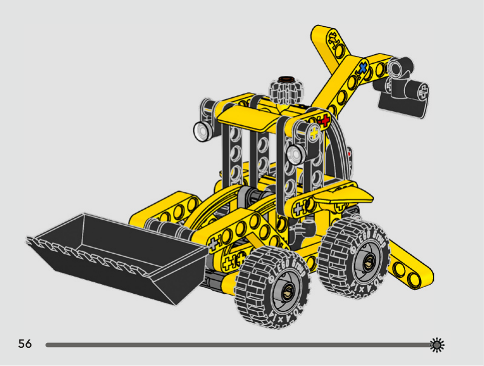
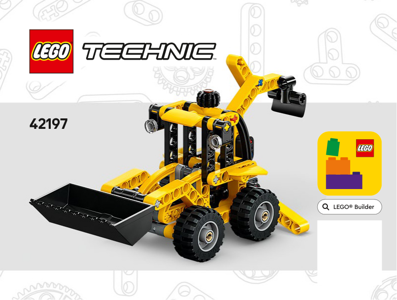
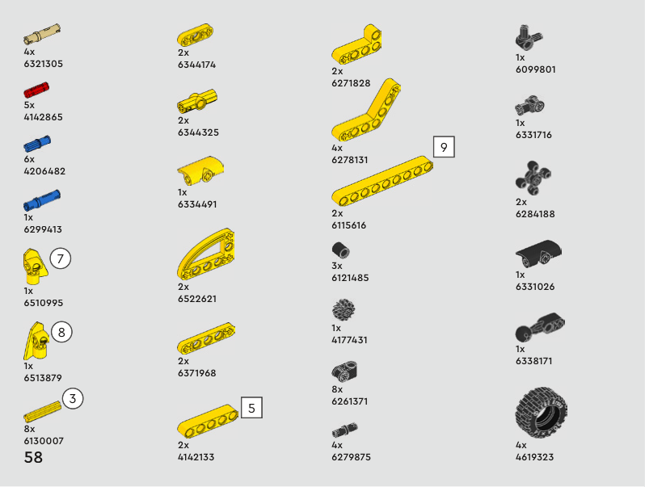
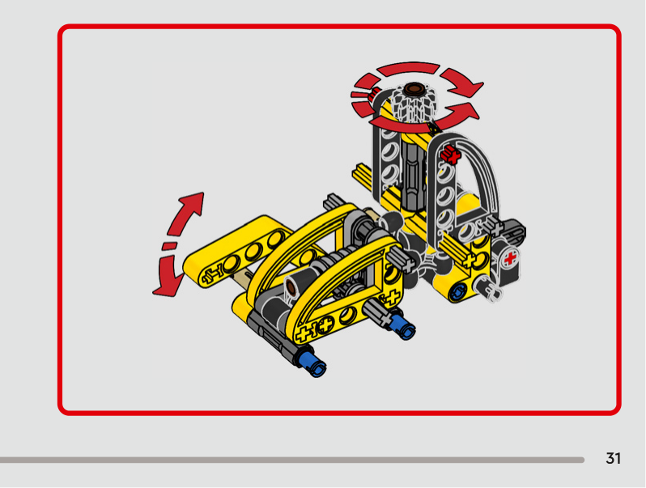
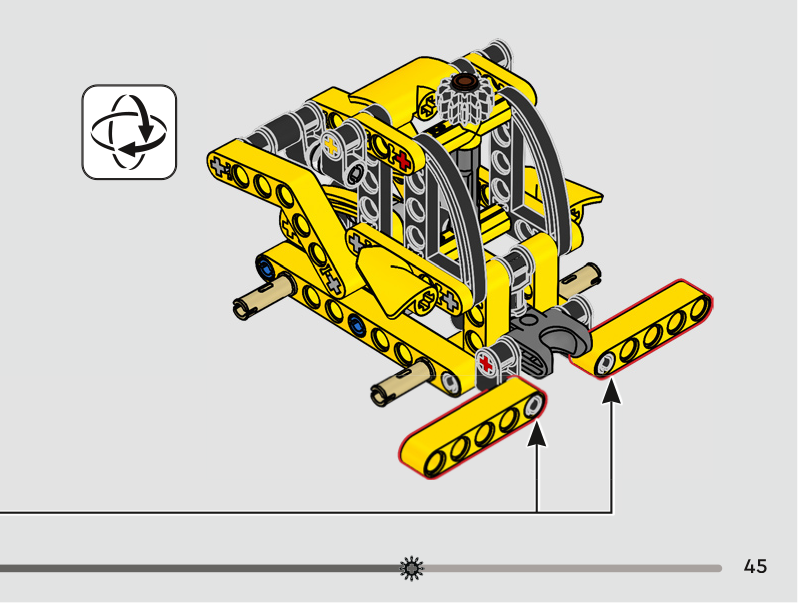

# LEGO Backhoe: Astra vs Opus

A benchmark that tests how well AI models can reason about 3D mechanical assembly. Each model gets the building instructions for **LEGO Technic set 42197 (Backhoe Loader)** and a strict parts brief. It must rebuild the whole machine as a JSON assembly graph: every part's position and orientation, every pin and axle joint, and the working mechanisms.

**▶ Try it online: https://ibrahimfahdah.github.io/LegoBackhoe-AstraVsOpus/**

This repo contains the prompt, the reference booklet, the outputs of two models (**GPT Astra** and **Claude Opus 5.5**), and a browser viewer that renders each model in 3D and scores it automatically.



## The task

The full prompt is in [inputPrompt/prompt.md](inputPrompt/prompt.md) and the booklet is [inputPrompt/backhoe.pdf](inputPrompt/backhoe.pdf). In short, the model must:

- Use **all 104 pieces (45 element types)** from the exact inventory, with the correct colours, and no extra parts.
- Place each part in a shared coordinate system (1 module = 8 mm; x = right, y = forward, z = up, ground at z = 0).
- Group the parts into the real subassemblies: chassis, drive tower, cab, loader gearbox, loader, backhoe, stabilizers and wheels.
- Describe every connection (pin, axle, ball, gear mesh, …) and whether it is fixed, rotates or swivels.
- Pose the machine as in the finished-model picture: loader bucket lowered in front, backhoe raised behind the cab, stabilizers angled down, and all four tyres on the ground.
- Make the five required functions work:

| Function | Description |
|---|---|
| F1 | Turning the top knob drives a knob-wheel → worm → 8-tooth gear train that raises and lowers the loader arms (self-locking) |
| F2 | All four wheels roll freely |
| F3 | The backhoe swivels on a ball joint |
| F4 | Each stabilizer leg pivots on its pin |
| F5 | The loader bucket tilts by hand |

The model is expected to check its work against the booklet and fix it over several passes. A single rough pass doesn't count as a finished answer.

### Reference booklet

| Cover | Parts inventory |
|---|---|
|  |  |

| Worm-drive gearbox and tower (step 31) | Loader arms going on (step 45) |
|---|---|
|  |  |

## Results

Both outputs were scored with the automated checker in [viewer/technic-core.js](viewer/technic-core.js).

| Check | GPT Astra | Opus 5.5 |
|---|---|---|
| Schema | ✅ | ✅ |
| Inventory (104 parts) | ✅ | ✅ |
| Colours | ✅ | ✅ |
| Feature references | ✅ 132 connections | ✅ 123 connections |
| Joint geometry | ❌ 6 joints misaligned | ❌ 3 joints misaligned |
| Joint types & motion | ⚠️ 3 notes | ✅ |
| Shaft occupancy | ✅ | ✅ |
| Connected assembly | ✅ | ✅ |
| Ground contact | ✅ | ✅ |
| Wheelbase (6 modules) | ✅ | ✅ |
| Collisions | ❌ 11 overlapping pairs | ❌ 10 overlapping pairs |
| F1 knob raises loader | ❌ drive train broken | ❌ drive train broken |
| F2 wheels roll | ✅ | ✅ |
| F3 backhoe swivels | ❌ ball joint fails | ✅ |
| F4 stabilizers pivot | ✅ | ✅ |
| F5 bucket tilts | ✅ | ❌ bucket joints all fixed |
| Layout | ✅ | ✅ |
| **Score (pass / warn / fail)** | **12 / 1 / 4** | **13 / 0 / 4** |
| **Time to finish** | **~20 minutes** | **~40 minutes** |

GPT Astra finished in about 20 minutes. Opus 5.5 took about 40 minutes, roughly twice as long.

To view a model in 3D, open its viewer page online ([GPT Astra](https://ibrahimfahdah.github.io/LegoBackhoe-AstraVsOpus/output/Astra/GPT_Astra.html) · [Opus 5.5](https://ibrahimfahdah.github.io/LegoBackhoe-AstraVsOpus/output/Opus5.5/opus5.5.html)), or open the self-contained HTML file locally:

- [output/Astra/GPT_Astra.html](output/Astra/GPT_Astra.html)
- [output/Opus5.5/opus5.5.html](output/Opus5.5/opus5.5.html)

## Human review

The outputs from both models are very close and both are good, but Astra seems to produce the better output.

## Repository layout

```
inputPrompt/
  prompt.md          The benchmark prompt given to each model
  backhoe.pdf        LEGO 42197 building instructions (visual reference)
output/
  Astra/             GPT Astra: output.json + a single-file viewer page
  Opus5.5/           Claude Opus 5.5: output.json + a single-file viewer page
viewer/
  technic-core.js    Parts catalog, geometry and quality checks (no DOM)
  technic-viewer.*   Browser viewer: 3D render, check report, part isolation
  technic-example.js Built-in demo model
  build-single.cjs   Bakes a model JSON into one self-contained HTML file
docs/images/         Pages taken from the instruction booklet
```

## Usage

**Interactive viewer:** open [viewer/technic-viewer.html](viewer/technic-viewer.html) in a browser. Click **Load JSON file** (or paste a model) and then **Render & check**. From there you can orbit the model, switch between front, side, rear and top views, isolate single parts, and save the check report.

**Build a single-file viewer for a model:**

```sh
node viewer/build-single.cjs output/Opus5.5/output.json output/Opus5.5/opus5.5.html "Opus 5.5"
```

**Run the tests:**

```sh
node --test viewer/*.test.cjs
```

## License

See [LICENSE.txt](LICENSE.txt). LEGO® and Technic are trademarks of the LEGO Group, which does not sponsor or endorse this project. The booklet images are used only as reference material for the benchmark.
